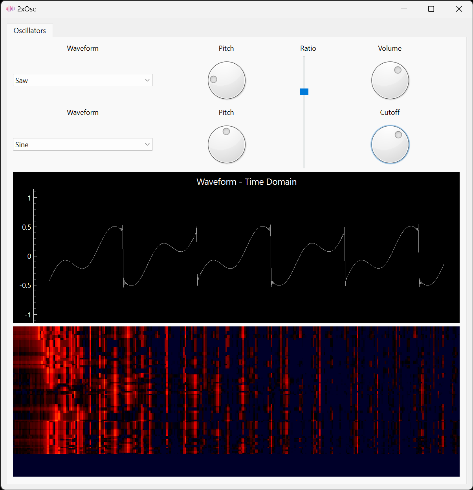

<h1 style="text-align: center;"><a href="https://github.com/nshie/synthesizer">2xOsc - A Basic Synthesizer</a></h1>

<h3 style="text-align: center;">github.com/nshie/synthesizer</h3>

<h3 style="text-align: center;">Nathan Shie</h3>

## Potential Applications

The main design of this synthesizer centers around music production. Oftentimes, music producers do not have the perfect sound for their songs lying around in their libraries. They need to create the sound from scratch using a synthesizer. Because of the wide range of sounds these synthesizers can create, their interfaces can become cluttered and overwhelming for producers who are just getting introduced to such tools. That is where 2xOsc comes in.

This basic synthesizer is a simple-to-use introduction to the world that is digital music synthesizers. Users are provided an intuitive graphical user interface to mess around with sound design. The graphs give users an intuitive understanding of what the knobs, sliders, and buttons do to their sound, while the piano-keyboard mimicry brings a familiar interface to musicians, allowing them to quickly hear and tweak their new instrument.

## Relation to Signals and Systems

On a macro scale, this synthesizer can be seen as a system that takes in two signals and outputs another signal by performing operations on the two inputs. Most of these operations involve adding the two signals, but the cutoff feature in particular provides something really interesting. This knob controls a lowpass filter to the signal, which is a crucial part (filters in general) to Signals and Systems. This filter attenuates the signal above a certain frequency specified by the user, which is shown in the frequency domain plot.

Speaking of, the frequency domain plot and the spectrum analyzer both demonstrate another major part of Signals and Systems--the Fourier Transform. The frequency domain plot applies the FFT algorithm to our generated waveform to show the user another perspective on their sound design: the frequency domain. Here we can see the peaks in our frequencies, and it also demonstrates how different timbres (waveforms) are a result of their constituent harmonic frequencies. For example, the grating sound of the sawtooth wave (a very popular sound in EDM and other electronic genres) is comprised of many different frequencies beyond the single note we are playing on the piano.

Lastly, the design of the program was heavily aided by the Nyquist–Shannon sampling theorem. Early on in development, the synthesizer produced choppy, distorted sounds from the pure audio that was generated. However, this was due to the aliasing caused by not sampling at a high enough frequency. The original plan was to guess around at sampling rates until the sound was not aliasing, but then I could run into an issue of processing taking too long. In the end, I settled on a sampling rate a little above the Nyquist frequency to provide buffer room for any potential discrepancies in data. This also aided in creating a real-time spectrum analyzer, since the sampling frequency chosen could be tuned to just allow the high frequencies to be reconstructed while not wasting any extra processing power on frequencies that are not in the range of the synthesizer.

## Controls
The top pane allows you to design your sound with 2 oscillators.

#### Waveform
The drop-down menu provides the choice between 4 wave shapes for each oscillator: sinusoidal, sawtooth, square, or triangular.

#### Pitch
This knob controls the pitch of each oscillator, with every step equal to a semitone in equal temperament tuning.

#### Ratio
The ratio slider controls the ratio between the top oscillator volume and the bottom oscillator. (e.g. only the top oscillator will play when the slider is at the top, only the bottom oscillator will play when the slider is at the bottom, and they will be equal in volume when the slider is in the middle)

#### Volume
The volume knob controls the overall volume of the combined oscillators

#### Cutoff
This knob controls the cutoff frequency for a low-pass filter

#### Playing Notes
The keyboard acts as a piano, allowing you to play notes. The keys are laid out similarly to a piano, with 'zxcvbnm,' representing the lower octave white keys, and 'qwertyui' representing the top octave white keys. The black keys are laid out in accordance with the piano layout, with 'sdghjl;' being the lower octave black keys, and '2356790=' being the upper octave black keys.

## Graphs

#### Waveform Visualizer
The top graph displays a representation of the synthesized waveform, either in the time or frequency domain. Click the graph to switch between the two. This graph is useful for getting an idea of what your changes do to the waveform.

#### Spectrum Analyzer
The bottom graph is a spectrum analyzer, displaying the spectra of your signal as you play notes.

## Libraries

NumPy - data manipulation
SciPy - waveform generators
PyQt6 - GUI and application building
PyQtGraph - plots and graphs
PyAudio - playing the waveform audio
PyInstaller - packaging into an executable

## References

https://stackoverflow.com/questions/19709018/convert-3-byte-stereo-wav-file-to-numpy-array\
This source was used to help convert the generated audio wave into a bytestream to be played by the computer's speakers.

https://gist.github.com/boylea/1a0b5442171f9afbf372\
This Github repository was referenced for the creation of the spectrum analyzer.

#### Documentation:
https://numpy.org/doc/stable/index.html

https://docs.scipy.org/doc/scipy/

https://doc.qt.io/qtforpython-6/
https://www.pythonguis.com/pyqt6-tutorial/

https://pyqtgraph.readthedocs.io/en/latest/index.html

https://people.csail.mit.edu/hubert/pyaudio/docs/

Every library's documentation was used extensively to build this application. Without these libraries, none of the features of this synthesizer would have been possible.